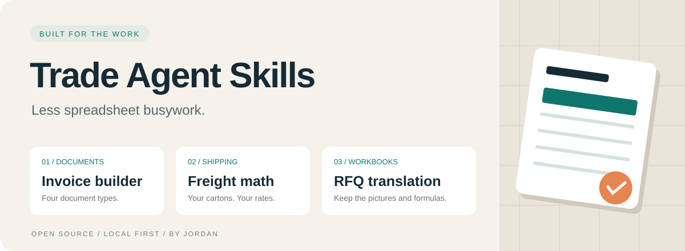
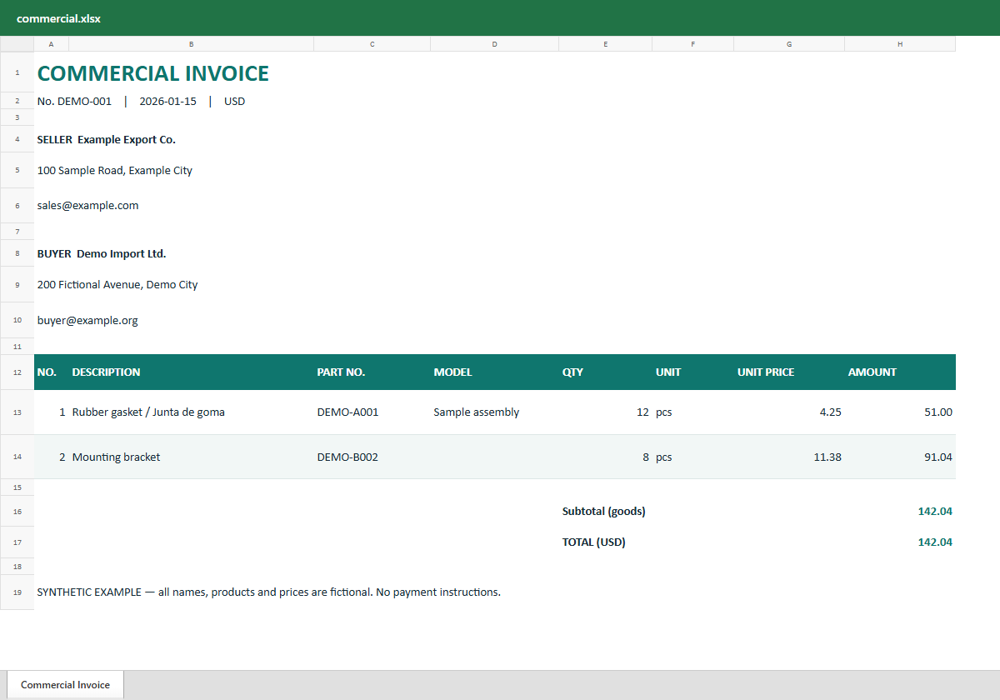

<p align="center"></p>

<p align="center">
  <a href="https://github.com/jordan-partstrade/trade-agent-skills/actions/workflows/check.yml"></a>
  
  <a href="LICENSE"></a>
</p>

<p align="center"><strong>WhatsApp RFQs. Invoices. Quotes. Freight. Pictures on the right rows.</strong><br>Nine practical skills and local scripts for everyday international trade work.</p>

<p align="center"><a href="README.md">简体中文</a> · English · <a href="https://partstradeai.com/">Made by Jordan</a></p>

## Nine tools for the trade desk

| Skill | What you get | Important boundary |
| --- | --- | --- |
| [whatsapp-rfq](skills/whatsapp-rfq) | Read scoped conversations and attachments through your existing WhatsApp MCP; package current demand, missing fields and withdrawn lines | Agent reviews meaning and images; no automatic sending |
| [invoice-builder](skills/invoice-builder) | Commercial / proforma / customs invoices and packing lists as XLSX | Your confirmed data; no pricing or HS-code inference |
| [freight-estimator](skills/freight-estimator) | Vehicle/part packing references, actual vs. volumetric weight, kg / CBM estimates | Supply packing evidence, rates and carrier terms |
| [translate-rfq](skills/translate-rfq) | Shared and inline text translated in a copy of the workbook | You or your agent supply translations; untouched ZIP members remain identical |
| [supplier-rfq](skills/supplier-rfq) | Supplier RFQs with images beside each item and blank response columns | Confirm part identity and review the actual pictures |
| [multi-quote](skills/multi-quote) | Multi-model tabs, separate quality options and a linked summary | Explicit quantities select options; no internal pricing defaults |
| [quote-audit](skills/quote-audit) | Read-only arithmetic, totals, hidden-content and internal-label checks | Explicit layout mapping; saved formula caches required |
| [xlsx-edit](skills/xlsx-edit) | Hash-bound existing-cell corrections in a copy | Formula expressions retained; caches cleared for recalculation |
| [landed-cost](skills/landed-cost) | Comparable door-to-door totals in a common currency | Unknown fees block a winner; supply costs and FX |

These are standalone public adaptations of tools used in my own trade workflow. They contain **no customer records, credentials, company defaults or carrier rate database**. All included examples are fictional. Scripts run locally, without an AI API key or a network call; the agent provides judgment and translation.

## WhatsApp intake

Install `whatsapp-rfq` together with `supplier-rfq`, and `translate-rfq` for customer workbooks. Use your existing WhatsApp MCP connection; [connection and receipt details](skills/whatsapp-rfq/references/whatsapp-mcp.md) are documented in Chinese. The agent fetches the specified conversation and attachments, checks corrections and cancellations, and prepares the packet without asking you to manually reconstruct the RFQ. A cloud agent receives the tool content through your chosen model provider.

The offline example uses fictional MCP receipts and a fictional picture. It does not connect to WhatsApp:

```bash
python skills/whatsapp-rfq/scripts/prepare_rfq.py examples/whatsapp-rfq.json --output out/whatsapp-demo
python skills/supplier-rfq/scripts/build_supplier_rfq.py out/whatsapp-demo/supplier-rfq.json --output out/whatsapp-demo/supplier-rfq.xlsx
```

The lamp quantity is corrected from 2 to 4; the oil filter is pending because its quantity is unknown; canceled mirrors are excluded. Keep `private-evidence.json`, `pending.json` and raw attachments local. Review the shareable workbook, and do not share the conversation evidence. Integration instructions were checked against the actual MCP tool definitions; tests use fictional receipts rather than live customer conversations. Nothing is automatically sent.

## Get started

Requires Python 3.10+. Workbook generation and quote checks use `openpyxl`; reference images use Pillow. Translation, bounded cell edits and cost math use the Python standard library.

```bash
git clone https://github.com/jordan-partstrade/trade-agent-skills.git
cd trade-agent-skills
python -m pip install -r requirements.txt
```

For **Codex**, copy the skill folders into your project's `.agents/skills/` directory. For **Claude Code**, use `.claude/skills/`. Copy the complete folder, including `scripts/` and any `assets/`. Example commands below run from the repository root; installed skills can be invoked using their actual script paths. Other agents can read `SKILL.md` directly, but their installation conventions may differ.

Example requests:

> Use invoice-builder to make a commercial invoice from these confirmed line items. Keep internal costs out, and show the final arithmetic.

> Use freight-estimator for these packed cartons and this carrier quote. Compare actual and volumetric weight, and list missing fees.

> Use translate-rfq to translate this Spanish RFQ into Chinese. Preserve part numbers, quantities, images and formulas. Review any untranslated text.

### Invoice → XLSX

```bash
python skills/invoice-builder/scripts/build_invoice.py examples/invoice.json --output out/commercial.xlsx
python skills/invoice-builder/scripts/build_invoice.py examples/invoice.json --kind customs --output out/customs.xlsx
python skills/invoice-builder/scripts/build_invoice.py examples/packing.json --kind packing --output out/packing.xlsx
```

The sample goods total is **USD 142.04**. A unit price of `11.375` is displayed as `11.38`; its quantity-8 line is `91.04`. Customs documents contain a goods subtotal without freight or a combined total. Packing lists have no prices and leave missing measurements blank. Customs output is a goods-value template, not a country-specific declaration form.

<details>
<summary>See the generated invoice (fictional data)</summary>



</details>

### Cartons + supplied rate → freight estimate

```bash
python skills/freight-estimator/scripts/estimate_freight.py examples/freight.json
python skills/freight-estimator/scripts/estimate_freight.py examples/freight-sea.json
```

Two 40 × 30 × 20 cm cartons at 6.1 kg each, with a divisor of 5000 and a per-carton 0.5 kg rounding step, bill at **13 kg**. At a fictional USD 4.50/kg plus 10% and USD 5 flat, the estimate is **USD 69.35**. Real rate cards differ; supply the carrier's divisor, minima and surcharges explicitly. A missing rate fails instead of returning a zero quote.

#### When packing is not confirmed yet

```bash
python skills/freight-estimator/scripts/prepare_shipment.py examples/vehicle-shipment.json --output out/prepared-shipment.json
python skills/freight-estimator/scripts/estimate_freight.py out/prepared-shipment.json
```

Vehicle **body type** and **size class** are separate. Supplied overall dimensions group reference records into explicit operational bins; they never become carton dimensions. The tool prioritizes actual packing and exact-OE records, then ranks same-model/platform and similar body/size records for large parts. Similar references require explicit selection, remain estimates, and preserve the stated source. A larger SUV does not automatically increase a small sensor's size. If packing is missing or ambiguous, no shipment file is written. No model specification or packing record is invented.

### RFQ → translated copy

```bash
python examples/make_demo_rfq.py out/demo-rfq.xlsx
python skills/translate-rfq/scripts/translate_xlsx.py extract out/demo-rfq.xlsx out/translations.json --glossary skills/translate-rfq/assets/es-zh-demo.json
# Fill empty translation values in out/translations.json.
python skills/translate-rfq/scripts/translate_xlsx.py apply out/demo-rfq.xlsx out/translations.json out/rfq-translated.xlsx
```

The demo includes multiple sheets, shared/inline strings, a rich-text run, formulas and a tiny synthetic image. The glossary fills five text nodes; **three labels remain unfilled** unless you translate them. Empty values keep the original text. The map is bound to the source file's SHA-256. Existing outputs are never overwritten. Images, styles, relationships and other untouched archive members are compared byte-for-byte before the output is published.

### Supplier RFQ and multi-model quote → XLSX

```bash
python skills/supplier-rfq/scripts/build_supplier_rfq.py examples/supplier-rfq.json --output out/supplier-rfq.xlsx
python skills/multi-quote/scripts/build_quote.py examples/multi-quote.json --output out/multi-quote.xlsx
python skills/quote-audit/scripts/audit_quote.py out/multi-quote.xlsx examples/quote-layout.json
```

Supplier images are embedded on the item row and re-encoded without original EXIF/GPS metadata; visible private text in a photo still needs review. Quote quality options are separate rows, each with its own editable quantity. Zero means unselected; positive quantities on two options order both. The fictional sample totals **USD 155.00**. The layout JSON explicitly identifies checked rows and total relationships; adapt it when the workbook changes. Missing formula caches fail rather than being treated as zero. An audit pass does not confirm fitment, pricing agreements or absence of every kind of confidential information.

<details>
<summary>See the supplier RFQ and model quote (fictional data)</summary>


</details>

### Correct a quantity while keeping the workbook package

```bash
python skills/xlsx-edit/scripts/edit_xlsx.py inspect out/multi-quote.xlsx --cell Compact E6
python examples/make_demo_edit.py out/multi-quote.xlsx --output out/edit-patch.json
python skills/xlsx-edit/scripts/edit_xlsx.py apply out/multi-quote.xlsx out/edit-patch.json --output out/quote-edited.xlsx
```

The patch changes the example quantity from 4 to 6. Source hash and old value must match; existing outputs and formula-cell edits are rejected. Unrelated package members are verified unchanged. All worksheet formula caches are cleared, including distant summary totals, and recalculation is requested. Open, recalculate and save in a spreadsheet application before using the new totals. This is a bounded existing-cell editor, not a structural workbook editor.

### Compare complete door-to-door offers

```bash
python skills/landed-cost/scripts/compare_costs.py examples/landed-cost.json
```

The example compares **USD 145.00 vs. 154.00**, including a supplied fictional exchange rate. Every fee category must be explicit. Known excluded charges can be zero; missing/null fees or missing FX block the lowest-cost selection. Compare the same goods, quantity, quality and destination, and count bundled charges once.

For website visitor checks and a general agent verification controller, see the separate [agent-handoff-review-verify tools](https://github.com/jordan-partstrade/agent-handoff-review-verify).

## Know the limits

- Review every customer-facing file before use. No script sends, books, files declarations or contacts anyone.
- Freight results are estimates. Live rates, customs duties, taxes, delivery and unspecified extras are not inferred.
- Rich-text runs are translated individually; review the complete phrase in the original cell. Names without digits need human/agent review even though digit-containing identifiers are protected.
- RFQ translation handles XLSX cell strings, not image text, comments, chart labels or formula results. Signed/encrypted files, duplicate ZIP members and workbooks over 512 MiB unpacked are rejected. The output filesystem must support hard links.
- Invoice values are rounded to two decimals using half-up rounding. Choose a different document workflow if your agreement requires higher price precision. Numeric inputs must be zero or within `1e-9` to `1e9`; extremely large calculations may exceed Decimal's supported precision and are rejected.

## Checks and contributions

```bash
python -m pip install ruff Pillow
python -m unittest discover -s tests -v
ruff check .
ruff format --check .
```

CI runs the regression suite on Windows and Linux. Got a useful trade workflow? [Open an issue](https://github.com/jordan-partstrade/trade-agent-skills/issues) with a fictional input and expected result. Please remove customer names, addresses, prices, bank details and credentials from examples.

[MIT](LICENSE) · [Jordan](https://partstradeai.com/)
